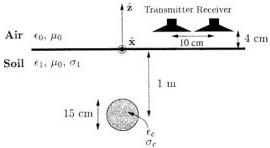
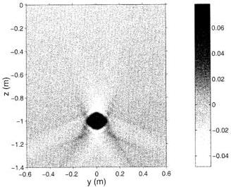
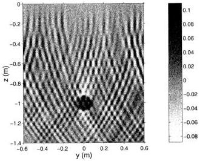
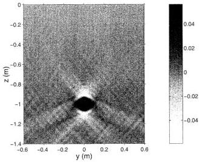

MEINCKE: LINEAR GPR INVERSION

2719

Fig. 2. Configuration consisting of a circular cylinder located in lossy soil. The constitutive parameters are $(\epsilon_c, \sigma_c) = (8.1\epsilon_0, 0.01 \text{ S/m})$ and $(\epsilon_1, \sigma_1) = (8\epsilon_0, 0.01 \text{ S/m})$.

Fig. 3. Image of $\Delta\epsilon/\epsilon_0$ for the configuration shown in Fig. 2. The regularization parameter $\lambda = 0$.

with

$$W_{pp'}(\mathbf{K}) = \frac{\Delta\omega D^*(\mathbf{K}, z_r, \omega_{p'})}{\sqrt{4k_1^2(\omega_p) - |\mathbf{K}|^2} - \sqrt{4k_1^2(\omega_{p'}) - |\mathbf{K}|^2^*}}. \tag{40}$$

The equations for the 2.5-D case is straightforwardly obtained by following the same approached as that outlined in Section III-E.

#### IV. NUMERICAL EXAMPLES

To demonstrate the performance of the inversion scheme of this paper the 2.5-D configuration shown in Fig. 2 is considered. This configuration is similar to the one considered by Hansen and Meincke-Johansen in [4] and consists of an infinitely long $\hat{\mathbf{x}}$-directed circular cylinder with diameter 15 cm located at $(y, z) = (0, -1)$ m. In the first example, the constitutive parameters of the cylinder are $(\epsilon_c, \sigma_c) = (8.1\epsilon_0, 0.01 \text{ S/m})$, and those of the soil are $(\epsilon_1, \sigma_1) = (8\epsilon_0, 0.01 \text{ S/m})$. The GPR uses 60 frequencies equally spaced in the range 20 MHz < f < 1.3 GHz, where $f = \omega/(2\pi)$. Moreover, the ideal dipole antennas of the GPR are $\hat{\mathbf{x}}$ directed, have a fixed offset of $\Delta_y = -10$ cm and are located $z_r = 4$ cm above the interface. The synthetic scattering data are obtained from an exact method described in [13]. Fig. 3 shows the image of $\Delta\epsilon/\epsilon_0$ obtained from

Fig. 4. Image of $\Delta\epsilon/\epsilon_0$ for the configuration shown in Fig. 2. Gaussian noise with variance $10^{-4}$ is added and the regularization parameter $\lambda = 0$.

Fig. 5. Image of $\Delta\epsilon/\epsilon_0$ for the configuration shown in Fig. 2. Gaussian noise with variance $10^{-4}$ is added and the regularization parameter is given by $\lambda^2 = 5.10^{33}$.

(25), (30), (33) and (35) with $\lambda = 0$. It is noted that there are no artifacts below the pipe as was the case in [4, Fig. 5]. This shows that the method of this paper produces images of higher quality than that of [4] because the loss is rigorously taken into account. The example also shows that it is not necessary to regularize when $\sigma_1 = 0.01$ S/m and simultaneously, no noise is present in the data.

To show the need for regularization, consider again the configuration in Fig. 2 but for this second example, Gaussian noise with variance $10^{-4}$ is added to the radar data. Fig. 4 shows the image with $\lambda = 0$ and in Fig. 5, the regularization parameter is given by $\lambda^2 = 5 \cdot 10^{33}$. Clearly, the effect of increasing the regularization parameter is to reduce the impact of the noise. However, since also information about the object is filtered away when increasing $\lambda$, the estimate of the maximum value of $\Delta\epsilon/\epsilon_0$ is not as accurate as in Fig. 3 where no noise is present.

Authorized licensed use limited to: Danmarks Tekniske Informationscenter. Downloaded on March 23,2010 at 10:16:38 EDT from IEEE Xplore. Restrictions apply.