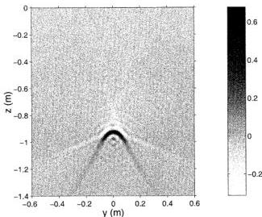

2720

IEEE TRANSACTIONS ON GEOSCIENCE AND REMOTE SENSING, VOL. 39, NO. 12, DECEMBER 2001

Fig. 6. Image of $\Delta\sigma$ for the case in which the pipe in Fig. 2 is perfectly electrically conducting. The regularization parameter $\lambda = 0$.

In the final example, it is shown that the inversion scheme also can be used to detect perfectly electrically conducting (PEC) pipes, although the Born approximation in this case is violated.³ The configuration is the same as that shown in Fig. 2, except that the object is a PEC pipe. The image of $\Delta\sigma$, derived from the procedure described in Section III-F with $\lambda = 0$, is shown in Fig. 6. Of course, the maximum value of $\Delta\sigma$ is wrong, but a perfect estimate of the location of the PEC pipe is obtained. The center of the image is at the top surface of the pipe, as also was the case in [4].

# V. CONCLUSIONS AND FUTURE WORK

This paper presented a diffraction tomography inversion scheme for fixed-offset GPR that accounts for the loss in the soil and the planar air–soil interface. The inversion scheme was obtained by applying the Tikhonov-regularized pseudo-inverse operator to the approximate forward model (12). By using this forward model, which is valid for objects buried just a few center wavelengths from the air–soil interface, the filtering step becomes conveniently simple and consists of solving integral equations of the first kind. Through numerical examples, it was illustrated that a satisfactory image quality is obtained by solving these integral equations by simple quadrature. Indeed, the artifacts in the image produced by the method of [4] are no longer present when using the inversion scheme of this paper. The regularization parameter, however, is at present determined by trial and error. An efficient determination of the optimum regularization parameter is important to make the inversion scheme complete and future research will therefore address this problem. Another issue subject to future research is the derivation of an approximate forward model that also works for evanescent plane waves in the soil. With such an approximate forward model available images of higher resolution can be produced with the pseudo-inverse operator.

³In [14], it is explained why the linear inversion schemes based upon the Born approximation can be used to detect PEC objects.

# APPENDIX

This appendix explains why the various methods for determining the optimum regularization parameter $\lambda$ do not apply to the filtering step (20). The starting point is the singular value expansion (SVE) of the operator $\mathcal{L}$ in (14) [9, p. 6], [11, p. 86]

$$\mathcal{L}\Delta\epsilon_1 = \sum_{i=1}^{\infty} \mu_i v_i \langle \Delta\epsilon_1, u_i \rangle_U. \quad (41)$$

Herein, $\mu_i$ are the singular values and $u_i, v_i$ are the singular functions and the inner product in $U$ is defined in (15). The singular values $\mu_i$ are nonnegative and they can always be ordered in nonincreasing order such that $\mu_1 \geq \mu_2 \geq \mu_3 \geq \dots \geq 0$ [9, p. 7]. Similarly, the SVE of the adjoint operator $\mathcal{L}^\dagger$ is

$$\mathcal{L}^\dagger \tilde{s}_o = \sum_{i=1}^{\infty} \mu_i u_i \langle \tilde{s}_o, v_i \rangle_V \quad (42)$$

where the inner product in $V$ is defined in (16) and the SVE of $\mathcal{L}\mathcal{L}^\dagger$ is

$$\mathcal{L}\mathcal{L}^\dagger \tilde{s}_o = \sum_{i=1}^{\infty} \mu_i^2 v_i \langle \tilde{s}_o, v_i \rangle_V. \quad (43)$$

Consequently, the Tikhonov-regularized pseudo-inverse operator in (18) can in terms of the SVE be written as

$$\mathcal{L}^\dagger (\mathcal{L}\mathcal{L}^\dagger + \lambda^2 I)^{-1} \tilde{s}_o = \sum_{i=1}^{\infty} u_i \frac{\mu_i \langle \tilde{s}_o, v_i \rangle_V}{\mu_i^2 + \lambda^2}. \quad (44)$$

To obtain a square integrable solution $\Delta\epsilon_1$ from the Tikhonov-regularized pseudo-inverse operator, the summation over $i$ in (44) must converge. In fact, if there is no noise (such that the data $\tilde{s}_o$ belong to the range of $\mathcal{L}$), a square integrable solution must exist for $\lambda = 0$. Thus, to ensure convergence for $\lambda = 0$, the absolute value of the coefficients $\langle \tilde{s}_o, v_i \rangle_V$ in (44) must decay faster than the singular values $\mu_i$ for some $i$. This requirement is referred to as the Picard condition [9, p. 9].

Consider now the filtering step (20) and note that the operator $(\mathcal{L}\mathcal{L}^\dagger + \lambda^2 I)^{-1} \tilde{s}_o$ can be written as

$$(\mathcal{L}\mathcal{L}^\dagger + \lambda^2 I)^{-1} \tilde{s}_o = \sum_{i=1}^{\infty} v_i \frac{\langle \tilde{s}_o, v_i \rangle_V}{\mu_i^2 + \lambda^2}. \quad (45)$$

Since the Picard condition is satisfied for the original problem (18) as explained previously, the absolute value of the coefficients $\langle \tilde{s}_o, v_i \rangle_V$ are guaranteed to decay faster than the singular values $\mu_i$ of $\mathcal{L}$ for some $i$. However, they are not guaranteed to decay faster than $\mu_i^2$ for some $i$, and the summation in (45) will not converge for $\lambda = 0$. Consequently, the Picard condition for the filtering step (20) is violated and the methods for determining the optimum $\lambda$ can therefore not be applied to (20).

# ACKNOWLEDGMENT

The authors would like to thank the Danish Technical Research Council for supporting this work. Also, the author thanks Prof. A. J. Devaney and Prof. P. C. Hansen for helpful discussions on inverse problems and also Dr. T. B. Hansen for providing the synthetic data used in the numerical examples.

Authorized licensed use limited to: Danmarks Tekniske Informationscenter. Downloaded on March 23, 2010 at 10:16:38 EDT from IEEE Xplore. Restrictions apply.