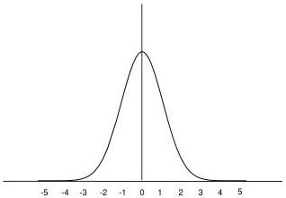

6.5 Random Sequences

87

Figure 6.4: A normal distribution of zero mean and unit variance. Almost all the area under this curve is contained within 3 standard deviations of the mean.

variance $\sigma^2$, then [Par60]:

$$P[\|X - \bar{x}\| \le \epsilon] \ge 1 - \frac{\sigma^2}{\epsilon^2}$$

for any $\epsilon > 0$.

This says that in order to make the probability of $X$ being within $\epsilon$ of the mean greater than some value $p$, we must choose $\epsilon$ at least as large as $\frac{p}{\sqrt{1-p}}$. Another way to say this would be: let $p$ be the probability that $x$ lies within a distance $\epsilon$ of the mean $\bar{x}$. Then Chebyshev's inequality says that we must choose $\epsilon$ to be at least as large as $\frac{p}{\sqrt{1-p}}$.

For example, if $p = .95$, then $\epsilon \ge 4.47\sigma$, while for $p = .99$, then $\epsilon \ge 10\sigma$. For the normal probability, this inequality can be sharpened considerably: the 99% confidence interval is $\epsilon = 2.58\sigma$. But you can see this in the plot of the normal probability in Figure 6.4. This is the standard normal probability (zero mean, unit variance). Clearly nearly all the probability is within 3 standard deviations.

### 6.5.1 The Central Limit Theorem

The other basic theorem of probability which we need for interpreting real data is this: the sum of a large number of independent, identically distributed random variables (defined on page 21), all with finite means and variances, is approximately normally distributed. This is called the central limit theorem, and has been known, more or less, since the time of De Moivre in the early 18-th century. The term "central limit theorem" was coined by George Polya in the 1920s. There are many forms of this result, for proofs you should consult more advanced texts such as [Sin91] and [Bru65].

0