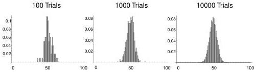

88

A Summary of Probability and Statistics

Figure 6.5: Output from the coin-flipping program. The histograms show the outcomes of a calculation simulating the repeated flipping of a fair coin. The histograms have been normalized by the number of trials, so what we are actually plotting is the relative probability of of flipping $k$ heads out of 100. The central limit theorem guarantees that this curve has a Gaussian shape, even though the underlying probability of the random variable is not Gaussian.

**Theorem 11** *Central Limit Theorem:* If $\bar{x}$ is the sample mean of a sample of size $n$ from a population with mean $\mu$ and standard deviation $\sigma$, then for any real numbers $a$ and $b$ with $a < b$

$$P \left[ \mu + \frac{a\sigma}{\sqrt{n}} < \bar{x} < \mu + \frac{b\sigma}{\sqrt{n}} \right] \rightarrow \frac{1}{\sqrt{2\pi}} \int_{a}^{b} e^{-z^2/2} dz.$$

This just says that the sample mean is approximately normally distributed.

Since the central limit theorem says nothing about the particular distribution involved, it must apply to even something as apparently non-Gaussian as flipping a coin. Suppose we flip a fair coin 100 times and record the number of heads which appear. Now, repeat the experiment a large number of times, keeping track of how many times there were 0 heads, 1, 2, and so on up to 100 heads. Obviously if the coin is fair, we expect 50 heads to be the peak of the resulting histogram. But what the central limit theorem says is that the curve will be a Gaussian centered on 50.

This is illustrated in Figure 6.5 via a little code that flips coins for us. For comparison, the exact probability of flipping precisely 50 heads is

$$\frac{100!}{50!50!} \left(\frac{1}{2}\right)^{100} \approx .076. \tag{6.48}$$

What is the relevance of the Central Limit Theorem to real data? Here are three conflicting views quoted in [Bra90]. From Scarborough (1966): “The truth is that, for the kinds of errors considered in this book (errors of measurement and observation), the Normal Law is *proved by experience*. Several substitutes for this law have been proposed, but none fits the facts as well as it does.”

From Press et al. (1986): “This infatuation [of statisticians with Gaussian statistics] tended to focus interest away from the fact that, for real data, the normal distribution

0