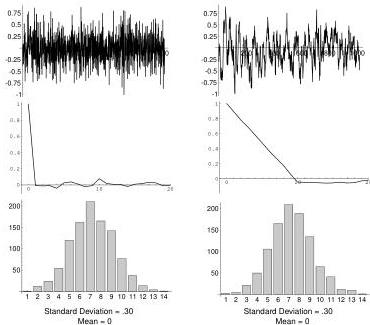

94

A Summary of Probability and Statistics

Figure 6.6: Two Gaussian sequences (top) with approximately the same mean, standard deviation and 1D distributions, but which look very different. In the middle of this figure are shown the autocorrelations of these two sequences. Question: suppose we took the samples in one of these time series and sorted them in order of size. Would this preserve the nice bell-shaped curve?

0