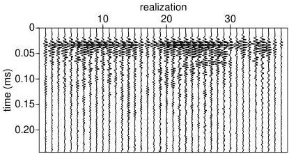

6.9 Random Fields

97

Figure 6.7: 38 realizations of an ultrasonic wave propagation experiment in a spatially random medium. Each trace is one realization of an unknown random process $U(t)$.

The study of random processes is both conceptually and notationally difficult. There are advanced mathematical books such as Pugachev's *Theory of Random Functions* [Pug65] which explain the situation, but from a physical point of view, one of the clearest explanations is in the book *Statistical Optics* by Goodman [Goo00]. We will follow his lead.

So let us assume that there is an underlying random process $U(t)$ (or $U(\mathbf{r})$ if we want to think about spatial randomness, it doesn't matter for our purposes), the probability law of which we do not know. The notation $U(t)$ is used to represent the ensemble of *all possible* outcomes of the random process along with their probabilities. Each outcome would be a function of time, say $u(t)$. It is as if $t$ is an index and $u$ labels the sample description space of the random process.

If we don't know the probability law of the random process, perhaps it is possible to nevertheless characterize $U$ by means, covariances, that sort of thing. Here is the theorem, which you can find in [Pug65]. To completely characterize the probability law of a stochastic process we must know the joint probability distribution

$$\rho_U(u_1, u_2, \dots, u_n, \dots; t_1, t_2, \dots, t_n, \dots)$$

for all $n$, where $u_1 = u(t_1)$, etc. Of course, in practice, we only make measurements of $U$ at a finite number of samples, so in practice we must make due with the $n-th$ order $\rho_U$. Now, the first-order PDF (probability density function) is $\rho_U(u; t)$. Knowing this

It is sometimes convenient to label the joint distribution by the random process, and sometimes by the order. So,

$$\rho_U(u_1, u_2, \dots, u_n; t_1, t_2, \dots, t_n) \equiv \rho_n(u_1, u_2, \dots, u_n; t_1, t_2, \dots, t_n)$$

0