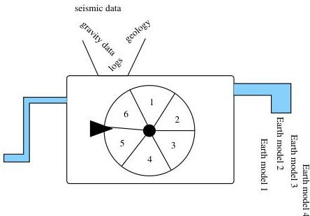

6.10 Probabilistic Information About Earth Models

99

Figure 6.8: A black box for generating pseudo-random Earth models that agree with our *a priori* information.

speed of light!), or that the mass of the planet is bounded above. Prior information can also be probabilistic, as we have discussed from a Bayesian perspective since the beginning of this course. In a later chapter we will treat problems with deterministic information using non-Bayesian methods, but for now we will consider probabilistic prior information.

There is a simple conceptual model that can be used to visualize the application of this diverse *a priori* information. Suppose we have a black box into which we put all sorts of information about our problem. We can turn a crank or push a button and out pops a model that is consistent with whatever information that is put in, as illustrated in Figure 6.8.

If this information consists of an expert's belief that, say, a certain sand/shale sequence is 90% likely to appear in a given location, then we must ensure that 90% of the models generated by the black box have this particular sequence. One may repeat the process indefinitely, producing a collection of models that have one thing in common: they are all consistent with the information put into the black box.

Let us assume, for example, that a particular layered Earth description consists of the normal-incidence P-wave reflection coefficient $r$ at 1000 different depth locations in some well-studied sedimentary basin. Suppose, further, that we know from *in situ* measurements that $r$ in this particular sedimentary basin almost never exceeds .1. What does it mean for a model to be consistent with this information? We can push the button on the black box and generate models which satisfy this requirement. Figure 6.9 shows

0