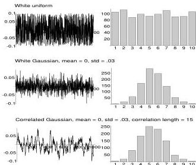

100

A Summary of Probability and Statistics

Figure 6.9: Three models of reflectivity as a function of depth which are consistent with the information that the absolute value of the reflection coefficient must be less than .1. On the right is shown the histogram of values for each model. The top two models are uncorrelated, while the bottom model has a correlation length of 15 samples.

some examples.

The three models shown satisfy the hard constraint that $|r| \leq .1$ but they look completely different. In the case of the two Gaussian models, we know this is because they have different correlation length. The real question is, which is most consistent with our assumed prior information? What do we know about the correlation length in the Earth? And how do we measure this consistency? If we make a histogram of the *in situ* observations of $r$ and it shows a nice bell-shaped curve, are we justified in assuming a Gaussian prior distribution? On the other hand, if we do not have histograms of $r$ but only extreme values, so that all we really know is that $|r| \leq .1$, are we justified in thinking of this information probabilistically?

If we accept for the moment that our information is best described probabilistically, then a plausible strategy for solving the inverse problem would be to generate a sequence of models according to the prior information and see which ones fit the data. Assuming, of course, that we know the probability function that governs the variations of the Earth's properties. In the case of the reflectivity sequence, imagine that we have surface seismic data to be inverted. For each model generated by the black box, compute synthetic seismograms, compare them to the data and decide whether they fit the data well enough to be acceptable. If so, the models are saved; if not, they are rejected. Repeating this procedure many times results in a collection of models that are, by definition, *a priori* reasonable and fit the data. If the models in this collection all look alike, then the features the models show are well-constrained by the combination of data fit and *a priori* information. If, on the other hand, the models show a diversity of features, then

0