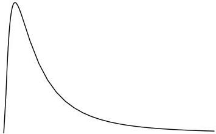

6.11 Other Common Analytic Distributions

101

Figure 6.10: The lognormal is a prototype for asymmetrical distributions. It arises naturally when considering the product of a number of iid random variables. This figure was generated from Equation 6.62 for s = 2.

these features cannot be well-resolved.

## 6.11 Other Common Analytic Distributions

Finally, we close this chapter by mentioning a few other commonly used analytic distributions. Nearly as important theoretically as the Gaussian, is the lognormal distribution. A variable X is lognormally distributed if Y = ln(X) is normally distributed. The central limit theorem treats the problem of sums of random variables; but the product of exponentials is the exponential of the sum of the exponents. Therefore we should expect that the lognormal would be important when dealing the a product of iid$^{e}$ random variables. One of these distributions, sketched in Figure 6.10, is the prototype of asymmetrical distributions. It also will play an important role later, when we talk about so-called non-informative distributions. In fact, there is a whole family of lognormal distributions given by

$$\rho(x) = \frac{1}{sx\sqrt{2\pi}} \exp \left[ -\frac{1}{2s^2} \left( \log \frac{x}{x_0} \right)^2 \right] \tag{6.62}$$

where x$_{0}$ plays the analog of the mean of the distribution and s governs the shape. For small values of s (less than 1), the lognormal distribution is approximately gaussian. While for large values of s (greater than about 2.5), the lognormal approaches 1/x. Figure 6.10 was computed for an s value of 2.

The Gaussian distribution is a member of a family of exponential distributions referred to as generalized Gaussian distributions. Four of these distributions are shown in Fig-

$^{e}$Independent, Identically Distributed.

0