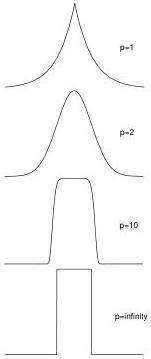

102

A Summary of Probability and Statistics

Figure 6.11: The generalized Gaussian family of distributions.

ure 6.11 for $p = 1, 2, 10$, and $\infty$. The $p = 1$ distribution is called the Laplacian or double-exponential, and the $p = \infty$ distribution is uniform.

$$\rho_p(x) = \frac{p^{1-1/p}}{2\sigma_p\Gamma(1/p)} \exp\left(\frac{-1}{p} \frac{|x - x_0|^p}{(\sigma_p)^p}\right) \tag{6.63}$$

where $\Gamma$ is the Gamma function [MF53] and $\sigma_p$ is a generalized measure of variance known in the general case as the dispersion of the distribution:

$$(\sigma_p)^p \equiv \int_{-\infty}^{\infty} |x - x_0|^p \rho(x) \, dx \tag{6.64}$$

where $x_0$ is the center of the distribution. See [Tar87] for more details.

0