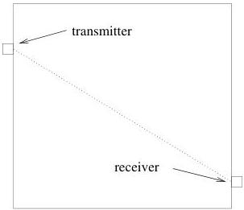

118

Tomography

Figure 8.1: An x-ray source shoots x-rays across a target to a detector where the intensity (energy) of the beam is measured.

### 8.1.1 The Forward Problem

Let $c(x, y)$ be the absorption coefficient in $\mathcal{D}_{\mathrm{X}}$; we assume that $c(x, y)$ is non-negative everywhere. Let $\mathbf{I}_T$ be the emitted beam intensity from a transmitter, $T$; and let $\mathbf{I}_R$ be the received intensity at some receiver, $R$. Then the absorption law is exactly

$$\mathbf{I}_R = \mathbf{I}_T e^{-\int_R^T c(x,y) d\lambda} \tag{8.1}$$

where the integral is along the (perfectly straight) path from $T$ to $R$ and $d\lambda$ is arc-length along the path. (Note that $c(x, y) = 0$ in a vacuum and the exponent in equation (8.1) vanishes.)

It is convenient to replace intensities with

$$\rho = \frac{\mathbf{I}_T - \mathbf{I}_R}{\mathbf{I}_T}, \tag{8.2}$$

which is just the fractional intensity drop. $\rho$ has the virtues that

- $\rho$ is independent of transmitter strength, $\mathbf{I}_T$,
- $\rho = 0$ for a beam which passes only through a vacuum,
- $\rho \ge 0$ for all reasonable media$^a$ and, in fact, $0 \le \rho < 1$, if $c(x, y)$ is everywhere non-negative and finite.

$^a$A “reasonable” medium is one which does not add energy to beams passing through. A laser is not a reasonable medium.

1