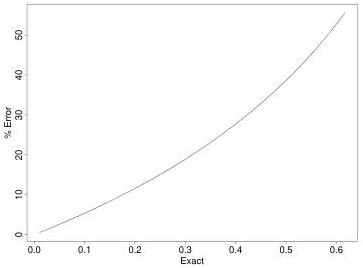

120

Tomography

Figure 8.2: The fractional error of the linearized absorption as a function of $\rho_{exact}$.

This result is a good approximation to the extent that the total relative absorption is much less than one.

An exact linearization can be had by changing the observable quantity from $\rho$ to $\log(\mathbf{I}_R/\mathbf{I}_T)$. Simply involves taking the logarithm of equation 8.1 leads to

$$\log(\mathbf{I}_R/\mathbf{I}_T) = -\int_R^T c(x, y) d\lambda$$

which assures us that the logarithms of the observed intensities are *exactly* linear in the absorption coefficient distribution ($c(x, y)$). We chose the approximate form, (8.3), when we developed the examples in order to induce some non-linearity into the calculation.

### Linearization Errors

It is very easy to compute the errors due to linearization in this case, since $\rho_{exact}$ can be easily related to $\rho_{linear}$ as

$$\rho_{exact} = 1 - e^{-\rho_{linear}}.$$

A plot of the fractional error of the linearized absorption,

$$\frac{\rho_{linear} - \rho_{exact}}{\rho_{exact}}$$

as a function of $\rho_{exact}$ is shown in Figure 8.2

1