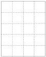

8.1 The X-ray Absorber

121

Figure 8.3: Geometry of the tomography problem. The model is specified by blocks of constant absorption.

Notice that the error expressed as a fraction is of the same order as the fractional absorption ($\rho_{exact}$). (For example, when $\rho_{exact} = 0.5$, error $\approx 40\%$.) In a rough sense, if we think of linearization as neglecting a quadratic term which has about the same coefficient as the linear term we are retaining, then we should expect an error of the same order as the quantity which has been linearized. Although this property is so simple as to be self-evident, it almost always comes as an ugly surprise in any particular application.

### 8.1.3 Model Representation

All of our inverse calculations use a model consisting of a regular array of homogeneous rectangular blocks. We completely specify a model's geometry by specifying the number of blocks along the $x$-axis ($N_x$) and the number of blocks along the $y$-axis ($N_y$). We completely specify a model by specifying its geometry and by specifying the $N_x N_y$ constant absorptivities of the blocks.

The geometry of a model with $N_x = 4$, $N_y = 5$ is shown in Figure 8.3.

We will need to map the cells in a model onto the set of integers $\{1, \ldots N_x N_y\}$. Let $C_{11}$ be the upper-left corner, $C_{N_x 1}$ be the upper-right corner, and let $C_{N_x N_y}$ be the lower-right corner. The matrix $\{C_{ij}\}$ is mapped onto the vector $\{m_k\}$ a row at a time, starting with the first (lowermost) row:

$$\{m_i\} = \{C_{11}, \ldots C_{N_x 1}, C_{1,2} \ldots C_{N_x N_y}\}$$

We chose this representation because it is very simple (possibly too simple for some applications) and it is strongly local. The latter property simply means that a perturbation in a model parameter only changes the values of $c(x, y)$ in a limited neighborhood. Strong locality makes some results quite a bit easier to interpret; the trade-off is that locality is always associated with discontinuities in the representation's derivatives.

1