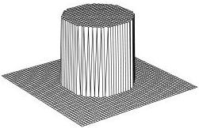

122

Tomography

Figure 8.4: A perspective view of the model.

### Model Sensitivity Vector

Let $\overline{TR}$ be the path joining a given transmitter-receiver pair, and let $\mathbf{m}$ be an absorption model, a vector of length $N_x N_y$. We want to find a vector, $\mathbf{q}(\overline{TR})$, a function of the path $\overline{TR}$ and of dimension $N_x N_y$, such that

$$\rho_{\text{linear}}(\mathbf{m}; T, R) = \mathbf{q}(\overline{TR}) \cdot \mathbf{m}. \tag{8.4}$$

It is easy to see, by inspection of (8.3), that $\mathbf{q}_i$ is simply the length of the portion of the path $\overline{TR}$ that passes through the $i$th block.

Notice that the components of $\mathbf{q}$ depend only upon the model representation and the path $\overline{TR}$. In particular, they are independent of the absorptivities.

### 8.1.4 Some Numerical Results

A perspective view of a model consisting of a centered disc of radius 0.25 is shown in Figure 8.4. inside the disc the absorption coefficient is 0.1 and outside of the disc it vanishes.

We sent nine shots through this structure. All of the shots came from a common transmitter in the upper-left corner and went to receivers spread along the right-hand side. The model and shot geometry looks like Figure 8.5.

Figure 8.6 shows the computed values of $\rho_{exact}$ as a function of receiver elevation.

The numerical value of the extinction for the lowermost ray was 0.048757. This ray traveled from the point (0, 0.9), the transmitter, to (1, 0.1), the receiver. The value of the integrated absorptivities along the path, the path integral in equation (8.1), should have been exactly 0.05 (as a little contemplation should show). From this we compute

1