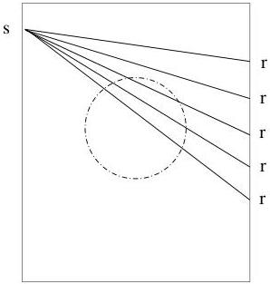

124

Tomography

Figure 8.7: Plan view of the model showing one source and five receivers.

$\rho_{true} = 0.048771$, which is in satisfactory agreement. (Note that the linearized estimate is exactly 0.05 and it is about 1% high.)

## 8.2 Travel Time Tomography

Along the same lines as the x-ray absorption problem, the time-of-flight of a wave propagating through a medium with wavespeed $v(x, y, z)$ is given by the line integral along the ray of the reciprocal wavespeed (slowness or index of refraction)

$$\int_{\mathrm{v}(\mathrm{x}, \mathrm{y}, \mathrm{z})} \frac{d\lambda}{v(x, y, z)}.$$

The problem is to infer the unknown wavespeed of the medium from repeated observations of the time-of-flight for various transmitter/detector locations. For the sake of definiteness, let's suppose that the source emits pressure pulses, the receiver is a hydrophone, and the medium is a fluid.

Figure (8.7) shows a 2D model of an anomaly embedded in a homogeneous medium. Also shown are 5 hypothetical rays between a source and 5 detectors. This is an idealized view on two counts. The first is that not only is the raypath unknown—rays refract—but the raypath depends on the unknown wavespeed. This is what makes the travel time inversion problem nonlinear. On the other hand, if we can neglect the refraction of the ray, then the problem of determining the wavespeed from travel time observations is completely linear.

1