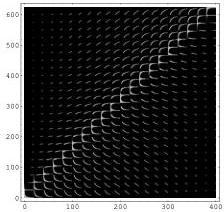
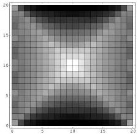
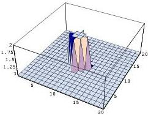

126

Tomography

Jacobian matrix

Illumination per cell

Exact model

Figure 8.8: Jacobian matrix for a cross hole tomography experiment involving $25 \times 25$ rays and $20 \times 20$ cells (top). Black indicates zeros in the matrix and white nonzeros. Cell hit count (middle). White indicates a high total ray length per cell. The exact model used in the calculation (bottom). Starting with a model having a constant wavespeed of 1, the task is to image the perturbation in the center.

1