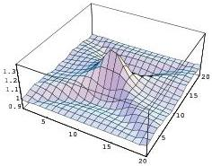
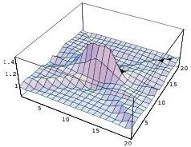
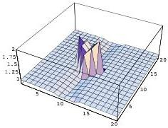

128

Tomography

# SVD reconstructions

First 10 singular values

First 50 singular values

All singular values above tolerance

Figure 8.9: SVD reconstructed solutions. Using the first 10 singular values (top). Using the first 50 (middle). Using all the singular values above the machine precision (bottom).

1