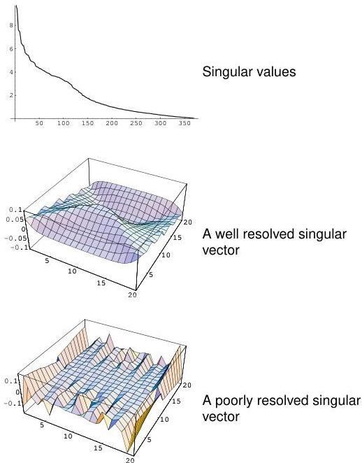

8.3 Computer Example: Cross-well tomography

129

Figure 8.10: The distribution of singular values (top). A well resolved model singular vector (middle) and a poorly resolved singular vector (bottom). In this cross well experiment, the rays travel from left to right across the figure. Thus, features which vary with depth are well resolved, while features which vary with the horizontal distance are poorly resolved.

1