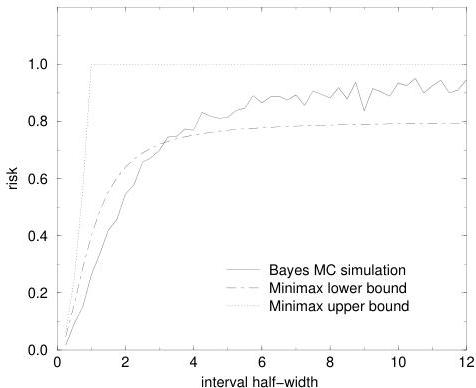

10.2 Example: A Toy Inverse Problem

143

Figure 10.1: For square error loss, the Bayes risk associated with a uniform prior is shown along with the upper and lower bounds on the minimax risk as a function of the size of the bounding interval $[-\beta, \beta]$. When $\beta$ is comparable to or less than the variance (1 in this case), the risk associated with a uniform prior is optimistic

1