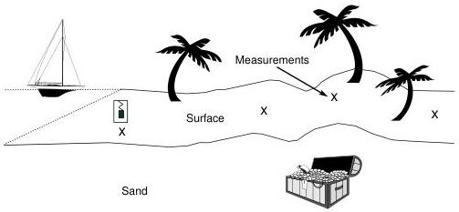

2

What Is Inverse Theory

Figure 1.1: We think that gold is buried under the sand so we make measurements of gravity at various locations on the surface.

respectively.ᵃ There's no simple formula, (at least not that we know) into which we can plug five observed gravity observations and receive in return the depth and size of our target.

So what shall we do? One thing we do know is

$$\phi(\mathbf{r}) = \int \frac{G\rho(\mathbf{r}')}{|\mathbf{r} - \mathbf{r}'|} dV' \tag{1.1}$$

that is, Newtonian gravitation. (If you didn't know it before, you know it now.) Equation 1.1 relates the gravitational potential, $\phi$, to density, $\rho$. Equation 1.1 has two interesting properties:

- it expresses something we think is true about the physics of a continuum, and
- it can be turned into an algorithm which we can apply to a given density field

So although we don't know how to turn our gravity measurements into direct information about the density in the earth beneath us, we do know how to go in the other direction: given the density in the earth beneath us, we know how to predict the gravity field we should observe. Inverse theory begins here, as in Figure 1.2.

For openers, we might write a computer program that accepts densities as inputs and produces predicted gravity values as outputs. Once we have such a tool we can play with different density values to see what kind of gravity observations we would get. We might assume that the gold is a rectangular block of the same dimensions as a standard

ᵃA gal is a unit of acceleration equal to one centimeter per second per second. It is named after Galileo but was first used in this century.

1