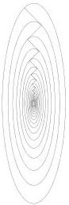

11.2 Conjugate Gradient

159

Figure 11.1: Contours of the quadratic form associated with the linear system $A\mathbf{x} = \mathbf{h}$ where $A = \mathrm{diag}(10,1)$ and $\mathbf{h} = (1, -1)$. Superposed on top of the contours are the solution vectors for the first few iterations.

Therefore,

$$(\mathbf{r}_k, \mathbf{r}_{k-1}) = (\mathbf{r}_{k-1}, \mathbf{r}_{k-1}) - \frac{(\mathbf{r}_{k-1}, \mathbf{r}_{k-1})}{(\mathbf{r}_{k-1}, A\mathbf{r}_{k-1})}(\mathbf{r}_{k-1}, A\mathbf{r}_{k-1}) \equiv 0 \tag{11.35}$$

So the residuals are pairwise orthogonal. The question naturally arises, is convergence always asymptotic? Is there ever a situation in which SD terminates in exact arithmetic? Using the above expression

$$\mathbf{r}_k = \mathbf{r}_{k-1} - \alpha_k A\mathbf{r}_{k-1} \tag{11.36}$$

we see that $\mathbf{r}_k = 0$ if and only if $\mathbf{r}_{k-1} = \alpha_k A\mathbf{r}_{k-1}$. But this just means that the residual at the previous step must be an eigenvector of the matrix $A$. We know that the eigenvectors of any symmetric matrix are mutually orthogonal, so this means that unless we start the steepest descent iteration so that the first residual lies along one of the principal axes of the quadratic form, convergence is not exact.

### 11.2.4 Computer Exercise: Steepest Descent

Write a program implementing SD for symmetric, positive definite matrices. Consider the following matrix, right-hand side, and initial approximation:

$$A = \{\{10, 0\}, \{0, 1\};$$

$$h = \{1, -1\};$$

$$x = \{0, 0\};$$

1