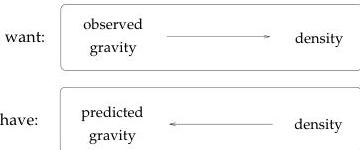
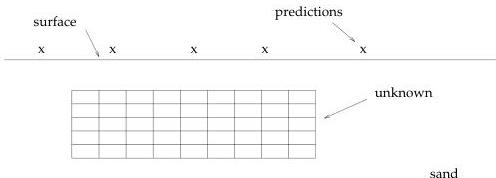

3

Figure 1.2: Inverse problems usually start with some procedure for predicting the response of a physical system with known parameters. Then we ask: how can we determine the unknown parameters from observed data?

Figure 1.3: An idealized view of the beach. The surface is flat and the subsurface consists of little blocks containing either sand or gold.

pirate's chest and we could move the block to different locations, varying both depth and horizontal location, to see if we can match our gravity observations.

Part of writing the gravity program is defining the types of density models we're going to use. We'll use a simplified model of the beach that has a perfectly flat surface, and has a subsurface that consists of a cluster of little rectangles of variable density surrounded by sand with a constant density. We've chosen the cluster of little rectangles to include all of the likely locations of the buried treasure. (Did we mention we have a manuscript fragment which appears to be part of a pirate's diary?) In order to model having the buried treasure at a particular spot in the model we'll set the density in those rectangles to be equal to the density of gold and we'll set the density in the rest of the little rectangles to the density of sand. Here's what the model looks like: The x's are the locations for which we'll compute the gravitational field. Notice that the values produced by our program are referred to as predictions, rather than observations.

Now we have to get down to business and use our program to figure out where the treasure is located. Suppose we embed our gravity program into a larger program which will

1