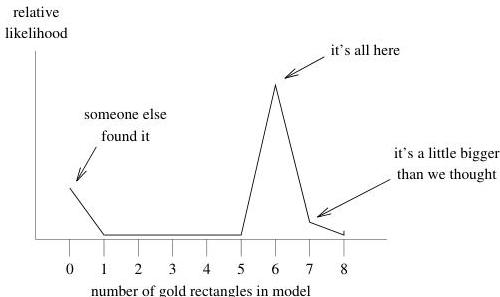

1.3 Implausible models

5

Figure 1.4: Our preconceptions as to the number of bricks buried in the sand. There is a possibility that someone has already dug up the gold, in which case the number of gold blocks is zero. But we thing it's most likely that there are 6 gold blocks. Possibly 7, but definitely not 3, for example. Since this preconception represents information we have independent of the gravity data, or prior to the measurements, it's an example of what is called a priori information.

## 1.3 Implausible models

On the basis of outside information (which we can't reproduce here because we unfortunately left it back at the hotel), we think that the total treasure was about the equivalent of six little rectangles worth of gold. We also think that it was buried in a chest which is probably still intact (they really knew how to make pirate's chests back then). We can't, however, be absolutely certain of either belief because storms could have rearranged the beach or broken the chest and scattered the gold about. It's also possible that someone else has already found it. Based on this information we think that some models are more likely to be correct than others. If we attach a relative likelihood to different number of gold rectangles, our prejudices might look like Figure 1.4. You can imagine a single Olympic judge holding up a card as each model is displayed.

Similarly, since we think the chest is probably still intact we favor models which have all of the gold rectangles in the two-by-three arrangement typical of pirate chests, and we will regard models with the gold spread widely as less likely. Qualitatively, our thoughts tend towards some specification of the relative likelihood of models, even before we're made any observations, as illustrated in Figure 1.5. This distinction is hard to capture in a quasi-quantitative way.

1