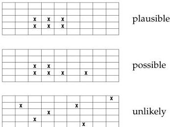

6

What Is Inverse Theory

Figure 1.5: Pirate chests were well made. And gold, being rather heavy, is unlikely to move around much. So we think it's mostly likely that the gold bars are clustered together. It's not impossible that the bars have become dispersed, but it seems unlikely.

**A priori information** Information which is independent of the observations, such as that models with the gold bars clustered are more likely than those in which the bars are dispersed, is called *a priori* information. We will continually make the distinction between a priori (or simply prior, meaning *before*) and a posteriori (or simply posterior, meaning *after*) information. Posterior information is the result of the inferences we make from data and the prior information.

What we've called *plausibility* really amounts to information about the subsurface that is independent of the gravity observations. Here the information was historic and took the form of prejudices about how likely certain model configurations were with respect to one another. This information is independent of, and should be used in addition to, the gravity observations we have.

## 1.4 Observations are noisy

Most observations are subject to noise and gravity observations are particularly delicate. If we have two models that produce predicted values that lie within reasonable errors of the observed values, we probably don't want to put much emphasis on the possibility that one of the models may fit slightly better than the other. Clearly learning what the observations have to tell us requires that we take account of noise in the observations.

1