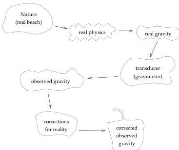

1.5 The beach is not a model

7

Figure 1.6: The path connecting nature and the corrected observations is long and difficult.

## 1.5 The beach is not a model

A stickier issue is that the real beach is definitely not one of the possible models we consider. The real beach

- is three-dimensional,
- has an irregular surface,
- has objects in addition to sand and gold within it (bones and rum bottles, for example)
- has an ocean nearby, and is embedded in a planet that has lots of mass of its own and which is subject to perceptible gravitational attraction by the Moon and Sun,
- *etc*

Some of these effects, such as the beach's irregular surface and the gravitational effects due to things other than the beach (the ocean, earth, Moon, Sun), we might try to eliminate by *correcting* the observations (it would probably be more accurate to call it *erroring* the observations). We would change the values we are trying to fit and, likely, increasing their error estimates. The observational process looks more or less like Figure 1.6 The wonder of it is that it works at all.

1