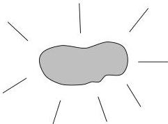

## Chapter 2

# A Simple Inverse Problem that Isn't

Now we're going to take a look at another inverse problem: estimating the density of the material in a body from information about the body's weight and volume. Although this sounds like a problem that is too simple to be of any interest to *real* inverters, we are going to show you that it is prey to exactly the same theoretical problems as an attempt to model the three-dimensional elastic structure of the earth from seismic observations.

Here's a piece of something (Figure 2.1): It's green, moderately heavy, and it appears to glow slightly (as indicated by the tastefully drawn rays in the figure). The chunk is actually a piece of *kryptonite*, one of the few materials for which physical properties are **not** available in handbooks. Our goal is to estimate the chunk's density (which is just the mass per unit volume). Density is just a scalar, such as **7.34**, and we'll use $\rho$ to denote various estimates of its value. Let's use $K$ to denote the chunk (so we don't have to say *chunk* again and again).

Figure 2.1: A chunk of kryptonite. Unfortunately, kryptonite's properties do not appear to be in the handbooks.

1