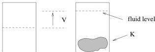
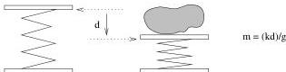

12

A Simple Inverse Problem that Isn't

Figure 2.2: A pycnometer is a device that measures volumes via a calibrated beaker partially filled with water.

Figure 2.3: A scale may or may not measure mass directly. In this case, it actually measures the force of gravity on the mass. This is then used to infer mass via Hooke's law.

## 2.1 A First Stab at $\rho$

In order to estimate the chunk's density we need to learn its *volume* and its *mass*.

### 2.1.1 Measuring Volume

We measure volume with an instrument called a *pycnometer*. Our pycnometer consists of a calibrated beaker partially filled with water. If we put $K$ in the beaker, it sinks (which tells us right away that $K$ is denser than water). If the fluid level in the beaker is high enough to completely cover $K$, and if we record the volume of fluid in the beaker with and without $K$ in it, then the difference in apparent fluid volume is equal to the volume of $K$. Figure 2.2 shows a picture of everyman's pycnometer. $V$ denotes the change in volume due to adding $K$ to the beaker.

### 2.1.2 Measuring Mass

We seldom actually measure mass. What we usually measure is the force exerted on an object by the local gravitational field, that is, we put it on a *scale* and record the resultant force on the scale (Figure 2.3).

In this instance, we measure the force by measuring the compression of the spring holding $K$ up. We then convert that to mass by knowing (1) the local value of the Earth's gravitational field, and (2) the (presumed linear) relation between spring extension and

1