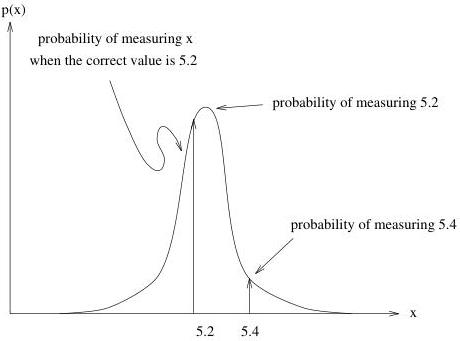

14

A Simple Inverse Problem that Isn't

Figure 2.4: Pay careful attention to the content of this figure: It tells us the distribution of measurement outcomes for a particular true value.

Physics News Number 183 by Phillip F. Schewe Improved mass values for nine elements and for the neutron have been published by an MIT research team, opening possibilities for a truly fundamental definition of the kilogram as well as the most precise direct test yet of Einstein's equation $E = mc^2$. The new mass values, for elements such as hydrogen, deuterium, and oxygen-16, are 20-1000 times more accurate than previous ones, with uncertainties in the range of 100 parts per trillion. To determine the masses, the MIT team, led by David Pritchard, traps single ions in electric and magnetic fields and obtains each ion's mass-to-charge ratio by measuring its cyclotron frequency, the rate at which it circles about in the magnetic field. The trapped ions, in general, are charged molecules containing the atoms of interest, and from their measurements the researchers can extract values for individual atomic masses. One important atom in the MIT mass table is silicon-28. With the new mass value and comparably accurate measurements of the density and the lattice spacing of ultrapure Si-28, a new fundamental definition of the kilogram (replacing the kilogram artifact in Paris) could be possible. The MIT team also plans to participate in a test of $E = mc^2$ by using its mass values of nitrogen-14, nitrogen-15, and a neutron. When N-14 and a neutron combine, the resulting N- 15 atom is not as heavy as the sum of its parts, because it converts some of its mass into energy by releasing gamma rays. In an upcoming experiment in Grenoble, France there are plans to measure the "E" side of the equation by making highly accurate measurements of these gamma rays. (F. DeFilippo et al, Physical Review Letters, 12 September.)

1