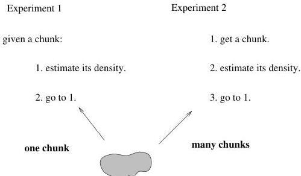

2.3 What is an Answer?

17

Figure 2.5: Two apparently different experiments.

entirely new aspect: selecting a chunk from a pool or source of chunks.c

Now we're going to do two things:

- We're going to persuade you (we hope) that both experiments are in fact the same, and they both involve acquiring (in principle) multiple chunks from some source.
- We're going to show you how to compute $P_{T|O}$ when the nature of the source of chunks is known and its character understood. After that we'll tackle (and never fully resolve) the thorny but very interesting issue of dealing with sources that are not well-understood.

### 2.3.4 The Experiments Are Identical

# Repetition Doesn't Affect Logical Structure

In the first experiment we accepted a particular $K$ and measured its density repeatedly by conducting repeated weighings. The number of times we weigh a given chunk affects the precision of the measurement but it does not affect the logical structure of the experiment. If we weigh each chunk (whether we use one chunk or many) one hundred times and average the results, the mass estimate for each chunk will be more precise, because we have reduced uncorrelated errors through averaging; we could achieve the

cThe Edmund Scientific catalog might be a good bet, although we didn't find kryptonite in it.

1