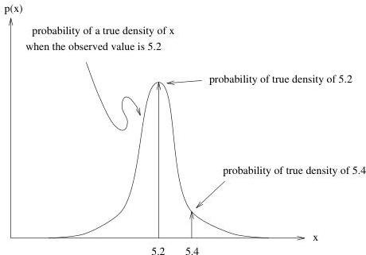

18

A Simple Inverse Problem that Isn't

Figure 2.6: $P_{T|O}$, the probability that the true density is $x$ given some observed value.

same effect by using a correspondingly better scale. This issue is experimentally significant but it is irrelevant to understanding the probabilistic structure of the experiment. For simplicity, then, we will assume that in both experiments, a particular chunk is measured only once.

### Answer is Always a Distribution

In the (now slightly modified) first experiment, we are given a particular chunk, $K$, and we make a single estimate of its mass, namely $\rho_O$. Since the scale is noisy, we have to express our knowledge of $\rho_T$, the true density, as a distribution showing the probability that the true density has some value given that the observed density has some other value. Our first guess is that it might have the *gaussianish* form that we had for $P_{O|T}$ in Figure 2.4. So Figure 2.6 shows the suggested form for $P_{T|O}$ constructed by cloning the earlier figure.

### A Priori Pops Up

This looks pretty good until we consider whether or not we know anything about the density of kryptonite *outside of the measurements* we have made.

1