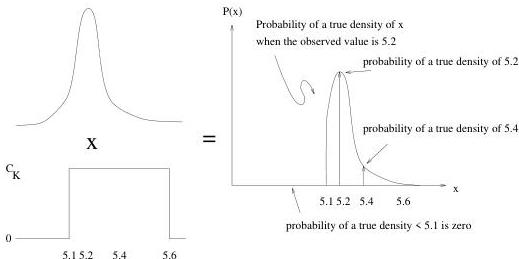

20

A Simple Inverse Problem that Isn't

Figure 2.7: A priori we know that the density of kryptonite cannot be less than 5.1 or greater than 5.6. If we're sure of this than we can reject any observed density outside of this region.

**Conclusion 1:** The correct *a posteriori* conditional distribution of density, $P_{T|O}$, depends in part upon the *a priori* distribution of *true* densities.

**Conclusion 2:** This connection holds even if the experiment consists of a single measurement on a single sample.

## 2.4 What does it mean to condition on the truth?

The kryptonite example hinges on a very subtle idea: when we make repeated measurements of the density of the sample, we are mapping out the probability $P_{O|T}$ even though we don't know the true density. How can this be?

We have a state of knowledge about the kryptonite density that depends on measurements and prior information. If we treat the prior information as a probability, then we are considering a hypothetical range of kryptonite densities any one of which, according to the prior probability, could be the true value. So the *variability* in our knowledge of the density is partly due to the range of possible *a priori* true density values, and partly due to the experimental variation in the measurements. However, when we make repeated measurements of a single chunk of kryptonite, we are not considering the universe of possible kryptonites, but just the one we are measuring. And so this repeated measurement is in fact conditioned on the true value of the density even though we don't know it.

1