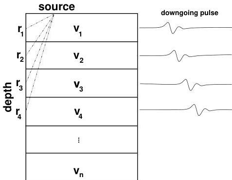

26

Example: A Vertical Seismic Profile

Figure 3.1: Simple model of a vertical seismic profile (VSP). An acoustic source is at the surface of the Earth near a vertical bore-hole (left side). A receiver is lowered into the bore-hole, recording the pulses of down-going sound at various depths below the surface. From these recorded pulses (right) we can extract the travel time of the first-arriving energy. These travel times are used to construct a best-fitting model of the subsurface wavespeed (velocity). Here $v_i$ refers to the velocity in discrete layers, assumed to be constant. How we discretize a continuous velocity function into a finite number of discrete values is tricky. But for now we will ignore this issue and just assume that it can be done.

1