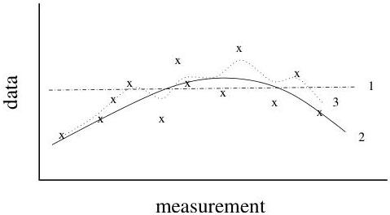

27

Figure 3.2: Noise is just that portion of the data we have no interest in explaining. The $x$'s indicate hypothetical measurements. If the measurements are very noisy, then a model whose response is a straight line might fit the data (curve 1). The more precisely the data are known, the more structure is required to fit them.

travel time can be computed by integrating the velocity along the ray path.

The goal is to somehow estimate $v(z)$ (or some function of $v(z)$, such as the average velocity in a region), or to estimate ranges of plausible values of $v(z)$. How well a particular $v(z)$ model fits the data depends on how accurately the data are known. Roughly speaking, if the data are known very precisely we will have to work hard to come up with a model that fits them to a reasonable degree. If the data are known only imprecisely, then we can fit them more easily. For example, in the extreme case of only noise, the mean of the noise fits the data.

**separating signal from noise** Consider the hypothetical measurements labeled with $x$'s in Figure 3.2. Suppose that we construct three different models whose predicted data are labeled 1, 2 and 3 in the figure. If we consider the uncertainty of the measurements to be large, we might might argue that a straight line fits the data (curve 1). If the uncertainties are smaller, them perhaps structure on the order of that shown in the quadratic curve is required (curve 2). If the data are even more precisely known, then more structure (such as shown in curve 3) is required. Unless we know the noise level in the data, to perform a quantitative inverse calculation we have to decide in advance which features we want to try to explain and which we do not.

Just as in the gravity problem we ignored all sorts of complicating factors, such as the effects of tides. Here we will ignore the fact that unless $v$ is constant, the rays will bend (refract); this means that the domain of integration in the travel time formula (equation 3.2) depends on the velocity, which we don't know. We will neglect this issue

1