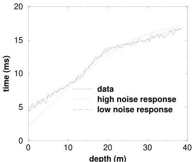

30

Example: A Vertical Seismic Profile

Figure 3.3: Observed data (solid curve) and predicted data for two different assumed levels of noise. In the optimistic case (dashed curve) we assume the data are accurate to 0.3 ms. In the more pessimistic case (dotted curve), we assume the data are accurate to only 1.0 ms. In both cases the predicted travel times are computed for a model that just fits the data. In other words we perturb the model until the RMS misfit between the observed and predicted data is about $N$ times 0.3 or 1.0, where $N$ is the number of observations. Here $N = 78$. I.e., $N\chi^2 = 78 \times 1.0$ for the pessimistic case, and $N\chi^2 = 78 \times .3$ for the optimistic case.

tion to properly interpret inversion estimates. In this particular case, we didn't simply pull these standard deviations out of hat. The low value (0.3 ms) is what you happen to get if you assume that the only uncertainties in the data are normally distributed fluctuations about the running mean of the travel times. However, keep in mind that nature doesn't really know about travel times. Travel times are approximations to the true properties (i.e., finite bandwidth) of waveforms. Further, the travel times themselves are usually assigned by a human interpreter looking at the waveforms. Based on these considerations, one might be led to conclude that a more reasonable estimate of the uncertainties for real data would be closer to 1 ms than 0.3 ms. In any event, the interpretation of the presence of a low velocity zone should be viewed with some scepticism unless the smaller uncertainty level can be justified.

1