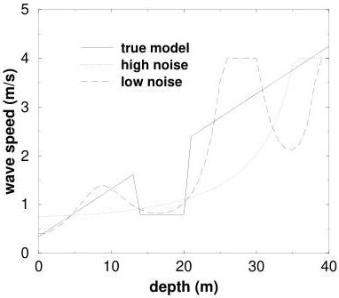

31

Figure 3.4: The true model (solid curve) and the models obtained by a truncated SVD expansion for the two levels of noise, optimistic (0.3 ms, dashed curve) and pessimistic (1.0 ms, dotted curve). Both of these models *just* fit the data in the sense that we eliminate as many singular vectors as possible and still fit the data to within 1 standard deviation (normalized $\chi^2 = 1$). An upper bound of 4 has also been imposed on the velocity. The data fit is calculated for the constrained model.

1