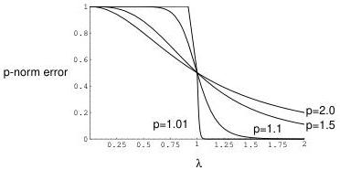

4.2 Matrix and Vector Norms

41

Figure 4.1: Family of $\ell_p$ norm solutions to the optimization problem for various values of the parameter $\lambda$. In accordance with the uniqueness theorem, we can see that the solutions are indeed unique for all values of $p > 1$, but that for $p = 1$ this breaks down at the point $\lambda = 1$. For $\lambda = 1$ there is a cusp in the curve.

For simplicity, let us assume that $\lambda \geq 0$ and let us solve the problem on the open interval $x \in (0, 1)$. The $\ell_p$ error function is just

$$E_p(x) \equiv [|x - 1|^p + \lambda^p |x|^p]^{1/p}. \tag{4.44}$$

Restricting $x \in (0, 1)$ means that we don't have to deal with the fact that the absolute value function is not differentiable at the origin. Further, the overall exponent doesn't affect the critical points (points where the derivative vanishes) of $E_p$. So we find that $\partial_x E_P(x) = 0$ if and only if

$$\left(\frac{1 - x}{x}\right)^{p-1} = \lambda^p \tag{4.45}$$

from which we deduce that the $\ell_p$ norm solution of the optimization problem is

$$x_{\ell_p} = \frac{1}{1 + \lambda^{p/(p-1)}}. \tag{4.46}$$

But remember, $\lambda$ is just a parameter. The theorem just alluded to guarantees that this problem has a unique solution for any $\lambda$ provided $p > 1$. A plot of these solutions as a function of $\lambda$ is given in Figure (4.1).

This family of solutions is obviously converging to a step function as $p \to 1$. And since this function is not single-valued at $\lambda = 1$, you can see why the uniqueness theorem is only valid for $p > 1$

### Interpretation of the $\ell_p$ norms

When we are faced with optimization problems of the form

$$\min_x \|A\mathbf{x} - \mathbf{y}\|_{\ell_p} \tag{4.47}$$

0