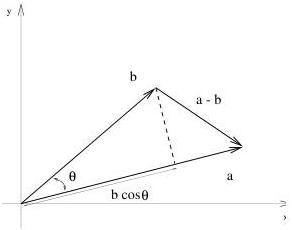

44

A Little Linear Algebra

Figure 4.3: Let $\mathbf{a}$ and $\mathbf{b}$ be any two vectors. We can always represent one, say $\mathbf{b}$, in terms of its components parallel and perpendicular to the other. The length of the component of $\mathbf{b}$ along $\mathbf{a}$ is $\|\mathbf{b}\| \cos \theta$ which is also $\mathbf{b}^T \mathbf{a} / \|\mathbf{a}\|$.

Now suppose we want to construct a vector in the direction of $\mathbf{a}$ but whose length is the component of $\mathbf{b}$ along $\|\mathbf{b}\|$. We did this, in effect, when we computed the tangential force of gravity on a simple pendulum. What we need to do is multiply $\|\mathbf{b}\| \cos \theta$ by a unit vector in the $\mathbf{a}$ direction. Obviously a convenient unit vector in the $\mathbf{a}$ direction is $\mathbf{a} / \|\mathbf{a}\|$, which equals

$$\frac{\mathbf{a}}{\sqrt{\mathbf{a}^T \mathbf{a}}}.$$

So a vector in the $\mathbf{a}$ with length $\|\mathbf{b}\| \cos \theta$ is given by

$$\begin{aligned} \|\mathbf{b}\| \cos \theta \hat{\mathbf{a}} &= \frac{\mathbf{a}^T \mathbf{b}}{\|\mathbf{a}\|} \frac{\mathbf{a}}{\|\mathbf{a}\|} \\ &= \frac{\mathbf{a}}{\|\mathbf{a}\|} \frac{\mathbf{a}^T \mathbf{b}}{\|\mathbf{a}\|} = \frac{\mathbf{a} \mathbf{a}^T \mathbf{b}}{\mathbf{a}^T \mathbf{a}} = \frac{\mathbf{a} \mathbf{a}^T}{\mathbf{a}^T \mathbf{a}} \mathbf{b} \end{aligned} \tag{4.50}$$

As an exercise verify that in general $\mathbf{a}(\mathbf{a}^T \mathbf{b}) = (\mathbf{a} \mathbf{a}^T) \mathbf{b}$. This is not completely obvious since in one expression there is an inner product in the parenthesis and in the other there is an outer product.

What we've managed to show is that the projection of the vector $\mathbf{b}$ into the direction of $\mathbf{a}$ can be achieved with the following matrix (operator)

$$\frac{\mathbf{a} \mathbf{a}^T}{\mathbf{a}^T \mathbf{a}}.$$

This is our first example of a projection operator.

0