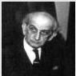

54

A Little Linear Algebra

experiment is unable to see the contribution due to the eigenvectors associated with zero eigenvalues.

Cornelius Lanczos was born in Hungary in 1893. His family name was Löwy, but this was changed to avoid the prevailing sentiments in Hungary against German names. Lanczos did his university work at Budapest where he studied mathematics and physics. He did work in general relativity throughout his life but made many important contributions to numerical analysis, including the development of the Fast Fourier Transform (25 years before Tukey). Lanczos' books are marvels of clarity. After fleeing Nazi Germany in the 1930s, Lanczos took up residence first in the US and then in Dublin, Ireland, where Schrödinger had built up a school of theoretical physics. He died on a trip to his native land in 1974.

## 4.9 Orthogonal projections

Above we said that the matrices $V$ and $U$ were orthogonal so that $V^T V = V V^T = I_m$ and $U^T U = U U^T = I_n$. There is a nice geometrical picture we can draw for these equations having to do with projections onto lines or subspaces. Let $\mathbf{v}_i$ denote the $i$th column of the matrix $V$. (The same argument applies to $U$ of course.) The outer product $\mathbf{v}_i \mathbf{v}_i^T$ is an $m \times m$ matrix. It is easy to see that the action of this matrix on a vector is to project that vector onto the one-dimensional subspace spanned by $\mathbf{v}_i$:

$$\left(\mathbf{v}_i \mathbf{v}_i^T\right) \mathbf{x} = (\mathbf{v}_i^T \mathbf{x}) \mathbf{v}_i.$$

A "projection" operator is defined by the property that once you've applied it to a vector, applying it again doesn't change the result: $P(P\mathbf{x}) = P\mathbf{x}$, in other words. For the operator $\mathbf{v}_i \mathbf{v}_i^T$ this is obviously true since $\mathbf{v}_i^T \mathbf{v}_i = 1$.

Now suppose we consider the sum of two of these projection operators: $\mathbf{v}_i \mathbf{v}_i^T + \mathbf{v}_j \mathbf{v}_j^T$. This will project any vector in $\mathbf{R}^m$ onto the plane spanned by $\mathbf{v}_i$ and $\mathbf{v}_j$. We can continue this procedure and define a projection operator onto the subspace spanned by any number $p$ of the model eigenvectors:

$$\sum_{i=1}^{p} \mathbf{v}_i \mathbf{v}_i^T.$$

If we let $p = m$ then we get a projection onto all of $\mathbf{R}^m$. But this must be the identity operator. In effect we've just proved the following identity:

$$\sum_{i=1}^{m} \mathbf{v}_i \mathbf{v}_i^T = V V^T = I.$$

0