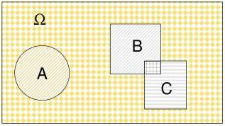
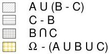

72

A Summary of Probability and Statistics

Figure 6.1: Examples of the intersection, union, and complement of sets.

### Example 1

Toss a fair die twice. By “fair” we mean that each of the 6 possible outcomes is equally likely. The sample space for this experiment consists of $\{1, 2, 3, 4, 5, 6\}$. There are six possible equally likely outcomes of tossing the die. There is only one way to get any given number $1 - 6$, therefore if $A$ is the event that we toss a 4, then the probability associated with $A$, which we will call $P(A)$ is

$$P(A) = \frac{N(A)}{N(\Omega)} = \frac{1}{6} \tag{6.1}$$

where we use $N(A)$ to denote the number of possible ways of achieving event $A$ and $N(\Omega)$ is the size of the sample space.

### 6.1.1 More on Sets

The *union* of two sets $A$ and $B$ consists of all those elements which are either in $A$ or $B$; this is denoted by $A \cup B$ or $A + B$. The *intersection* of two sets $A$ and $B$ consists of all those elements which are in both $A$ and $B$; this is denoted by $A \cap B$ or simply $AB$. The *complement* of a set $A$ relative to another set $B$ consists of those elements which are in $A$ but not in $B$; this is denoted by $A - B$. Often, the set $B$ is this relationship is the entire sample space, in which case we speak simply of the complement of $A$ and denote this by $A^c$. These ideas are illustrated in Figure 6.1

0