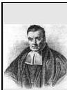

6.4 Probability Functions and Densities

79

These are known as Bayes' theorem.

Suppose we have $n$ mutually exclusive and exhaustive events $C_i$. By mutually exclusive we meant that the intersection of any two of the $C_i$ is the empty set (the set with no elements)

$$C_i C_j = \emptyset. \tag{6.16}$$

By exhaustive we meant that the union of all the $C_i$ fills up the entire sample space (i.e., the *certain* event)

$$C_1 \cup C_2 \cup \dots \cup C_n = \Omega. \tag{6.17}$$

It is not difficult to see that for any event $B$, we have

$$P(B) = P(BC_1) + P(BC_2) + \dots + P(BC_n). \tag{6.18}$$

You can think of this as being akin to writing a vector as the sum of its projections onto orthogonal (independent) directions (sets). Since the $C_i$ are independent and exhaustive, every element in $B$ must be in one of the intersections $BC_i$; and no element can appear in more than one. Therefore $B = BC_1 \cup \dots + BC_n$, and the result follows from the additivity of probabilities. Finally, since we know that for any $C_i$ $P(BC_i) = P(B|C_i)P(C_i)$ it follows that

$$P(B) = P(B|C_1)P(C_1) + P(B|C_2)P(C_2) + \dots + P(B|C_n)P(C_n). \tag{6.19}$$

This gives us the following generalization of Bayes' Theorem

$$P(C_i|B) = \frac{P(BC_i)}{P(B)} = \frac{P(B|C_i)P(C_i)}{\sum_{j=1}^n P(B|C_j)P(C_j)}. \tag{6.20}$$

Thomas Bayes (1702-1761) is best known for his theory of probability outlined in his *Essays towards solving a problem in the doctrine of chances* published in the Philosophical transactions of the Royal Society (1763). He wrote a number of other mathematical essays but none were published during his lifetime. Bayes was a nonconformist minister who preached at the Presbyterian Chapel in Turbridge Wells (south of London) for over 30 years. He was elected a fellow of the Royal Society in 1742.

## 6.4 Probability Functions and Densities

So far in this chapter we have dealt only with discrete probabilities. The sample space $\Omega$ has consisted of individual events to which we can assign probabilities. We can assign probabilities to collections of events by using the rules for the union, intersection and complement of events. So the probability is a kind of *measure* on sets. 1) It's

0