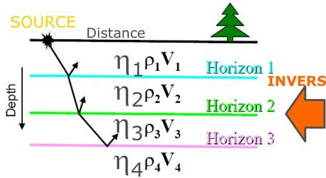
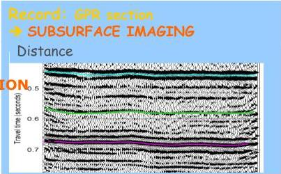

UNIVERSITAS
DEGLI STUDI
DI TRIESTE

UD4d[{"box_2d": [924, 9, , [924,, [, [, [ [ [ [ [ [ [ [ [ [ [ [ [ [ [ [ [ [ [ [ [ [ [ [ [ [ [ [ [ [ [ [ [ [ [ [ [ [ [ [ [ [ [ [ [ [ [ [ [ [ [ [ [ [ [ [ [ [ [ [ [ [ [ [ [ [ [ [ [ [ [ [ [ [ [ [ [ [ [ [ [ [ [ [ [ [ [ [ [ [ [ [ [ [ [ [ ["}][{"box_2d": [25, 115, 877, 214], "label":": "title", "caption": "# Example of EM amplitude inversion techniques\nStatement of the problem/Motivation"}]

**Wave field methods** are based on the propagation of a perturbation (wave) within the earth.

The most commonly used wavefields are Seismic (elastic waves) and Electromagnetic waves.

The perturbation (or signal) travels into the subsurface, is REFLECTED / REFRACTED / SCATTERED / BACKSCATTERED / CONVERTED and therefore can be recorded at the surface (or into a borehole) by one or more sensors as a function of the time (typically the time zero is the energizing instant).

No data inversion is required (but it is possible!) → direct IMAGING of the subsurface.

MEMAG A.A. 2021-2022

11