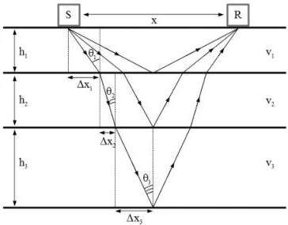

[LOGO]

UNIVERSITÀ
DEGLI STUDI
DI TRIESTE

UD4d

# The inversion method

Developed for COMMON OFFSET
TE (broadside) configuration i.e. the usual one
for GPR acquisition.

For each GPR trace the inversion algorithm iteratively
calculates for each layer the thickness and the EM
velocity by reconstructing from the geometrical
data/assumptions and from the picked reflection
amplitudes:

1) the travel paths of each reflected wave;
2) the values of the reflection coefficients.

Each inversion cycle reconstructs the travel path of a reflection.

In the n-th cycle we know:

- the first n-1 layer
thicknesses
- the first n layer velocities
The n-th cycle calculates:
- the n-th layer thickness (hₙ)
- the (n+1)-th layer velocity

$$TWT_n = \sqrt{\frac{x^2}{\bar{v}_n^2} + 4 \left( \sum_{i=1}^n \frac{h_i}{v_i} \right)^2},$$

with

$$\bar{v}_n^2 = \sum_{i=1}^n v_i h_i \Bigg/ \sum_{i=1}^n \frac{h_i}{v_i},$$

$$ah_n^2 + bh_n^2 + ch_n + d = 0,$$

where

$$a = 4/v_n,$$

$$b = \frac{4}{v_n^2} \sum_{i=1}^{n-1} v_i h_i + 8 \sum_{i=1}^{n-1} \frac{h_i}{v_i},$$

$$c = \frac{x^2}{v_n} + \frac{8}{v_n} \left( \sum_{i=1}^{n-1} v_i h_i \right) \left( \sum_{i=1}^{n-1} \frac{h_i}{v_i} \right) + 4v_n \left( \sum_{i=1}^{n-1} \frac{h_i}{v_i} \right)^2$$

$$- v_n TWT_n^2,$$

$$d = x^2 \sum_{i=1}^{n-1} \frac{h_i}{v_i} + 4 \left( \sum_{i=1}^{n-1} v_i h_i \right) \left( \sum_{i=1}^{n-1} \frac{h_i}{v_i} \right)^2 - TWT_n^2 \sum_{i=1}^{n-1} v_i h_i.$$

Forte E., Dossi M., Colucci R.R. and Pipan M., 2013, A new fast methodology to estimate the density of frozen materials by means of common offset GPR data, JAG, 99, 135-145.
Forte E., Dossi M., Pipan M. and Colucci R.R., 2014, Velocity analysis from Common Offset GPR data inversion: theory and application to synthetic and real data, Geophysical Journal International, 197, 3, 1471-1483.

MEMAG A.A. 2021-2022

15