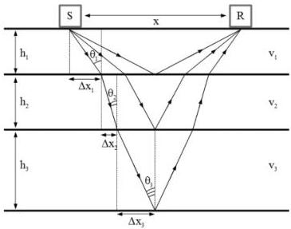

UNIVERSITAS DEGLI STUDIORUM
MIMES

UNIVERSITÀ
DEGLI STUDI
DI TRIESTE

UD4d

# The inversion method

From the Snell equation $$v_{2}=\frac{\sin(\vartheta_{2})}{\sin(\vartheta_{1})}v_{1}$$ we obtain:

$$\Delta x_{k}=\frac{v_{k}h_{k}}{v_{k-1}h_{k-1}}\Delta x_{k-1}.$$ With: $$\sin(\vartheta_{k})\approx\frac{\Delta x_{k}}{h_{k}}$$

We calculate the incidence angles along the path of the n-th reflected wave as:

$$\vartheta_{k}=\operatorname{Arctan}\frac{xv_{k}}{2\sum_{i=1}^{n}v_{i}h_{i}},$$

with $$k=1,2,\ldots,n$$.

With such angles we calculate the n-1 reflection and transmission coefficients using the Fresnel equations for the TE mode.

Using these coefficients

$$Ai_{n}=Ai_{1}\prod_{i=1}^{n-1}T_{i},$$

$$Ar_{n}=\frac{As_{n}}{\prod_{i=1}^{n-1}(2-T_{i})}.$$

and so the reflection coefficient of the n-th interface for the n-th reflected wave is

$$R_{n}=\frac{Ar_{n}}{Ai_{n}}$$

The velocity in the n+1 layer is given by the Snell eq. as:

$$R_{k}=\frac{\sin(\vartheta_{k+1}-\vartheta_{k})}{\sin(\vartheta_{k+1}+\vartheta_{k})},$$

$$T_{k}=1+R_{k},$$

with $$k=1,2,\ldots,n-1$$.

$$v_{n+1}=\frac{\sin(\vartheta_{n+1})}{\sin(\vartheta_{n})}v_{n},$$

with

$$\vartheta_{n+1}=\operatorname{Arctan}\left(\frac{1+R_{n}}{1-R_{n}}\tan\vartheta_{n}\right)$$

MEMAG A.A. 2021-2022

17