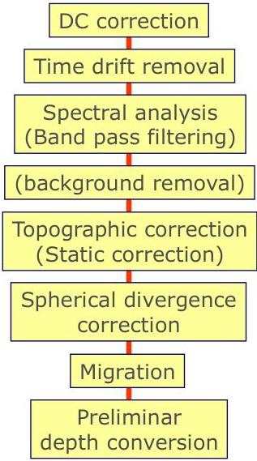

UNIVERSITÀ DEGLI STUDI DI TRIESTE

UD4d[{"box_2d": [924, 9, 996, 43], "label": "header_footer", "caption": "The,,,,,[{"box_2d": [26, 99, 335, 137], "":": "title", "caption": "# The inversion method"}]

# Data Processing

To make possible the data INVERSION, data must be processed in "true amplitude"
In a GPR experiment, even in case of virtually lossless materials, amplitudes are primarily affected by:

(A) scattering, (B) geometrical spreading, (C) partial reflections.

(A) Diffractions can be focused by means of migration algorithms

(B) Geometrical spreading can be corrected by using divergence recovery. Due to the antenna directivity, a precise correction can be obtained only if the radiation pattern into the subsurface is known.

Since this can be measured only through complex polarimetric/multicomponent experiments, a spherical divergence correction can be considered a valid first approximation. We apply a spherical divergence correction with a velocity constant for each survey based on combined CMP analysis and direct data validation with glaciological pits.

(C) The effect of partial reflections can be analytically removed starting from the uppermost reflector down to the basal one.

 [716,, [716,,, [716, [0, [0, [0, 1, 2, 3, 4, 5, 6, 7, 8, 9, 10, 11, 12, 13, 14, 15, 16, 17, 18, 19, 20, 21, 22, 23, 24, 25, 26, 27, 28, 29, 30, 31, 32, 33, 34, 35, 36, 37, 38, 39, 40, 41, 42, 43, 44, 45, 46, 47, 48, 49, 50, 51, 52, 53, 54, 55, 56, 57, 58, 59, 60, 61, 62, 63, 64, 65, 66, 67, 68, 69, 70, 71, 72, 73, 74, 75, 76, 77, 78, 79, 80, 81, 82, 83, 84, 85, 86, 87, 88, 89, 90, 91, 92, 93, 94, 95, 96, 97, 98, 99, 100]"}][{"box_2d [717, [717,, [717,,,,,, [719, [0, [0, 1, 2, 3, 4, 5, 6, 7, 8, 9, 10, 11, 12, 13, 14, 15, 16, 17, 18, 19, 20, 21, 22, 23, 24, 25, 26, 27, 28, 29, 30, 31, 32, 33, 34, 35, 36, 37, 38, 39, 40, [0, 1, 2, 3, 4, 5, 6, 7, 8, 9, 10, 11, 12, 13, 14, 15, 16, 17, 18, 19, 20, 21, 22]"}][{"box_2d": [717, [717,, [717,,,, [717,, [0, [0, 1, 2, 3, 4, 5, 6, 7, 8, 9, 10, 11, 12, 13, 14, 15, 16, 17, 18, 19, 20, 21, 22, 23, 24, 25, 26, 27, 28, 29, 30, 31, 32, 33, 34, 35, 36, 37, 38, 39, 40, [0, 1, 2, 3, 4, 5, 6, 7, 8, 9, 10, 11, 12, 13, 14, 15, 16, 17, 18, 19, 20, 21, 22]"}]

MEMAG A.A. 2021-2022 18