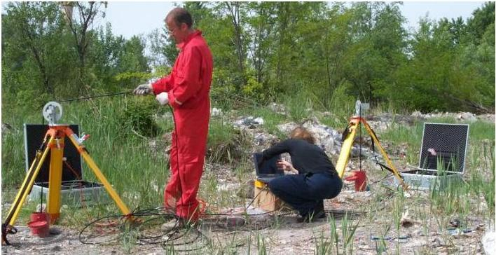

[LOGO]

UNIVERSITÀ
DEGLI STUDI
DI TRIESTE

UD4d

# Ground Penetrating Radar: Inversions and analyses

## Outline

1. Multi azimuth acquisitions (co-polarized and cross-polarized). Theory and examples of application for linear targets detection
2. EM amplitude inversion techniques.
Theory and examples of application/validation for glaciological targets.
3. GPR borehole data acquisition and inversions (traveltimes and amplitudes

MEMAG A.A. 2021-2022

2