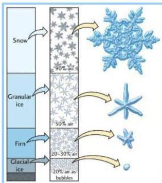
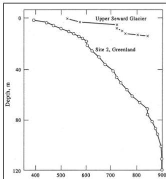

UNIVERSITÀ DEGLI STUDI DI TRIESTE

UD4d

## The inversion method for glaciological surveys: why so?

An accurate EM velocity estimation is essential, since:

- • small glaciers and glacierets can show **significant vertical and lateral density variations**.
- • **large density changes** correspond to relatively **smaller EM velocity variations**.

Density distribution is commonly assumed to be **constant or slow-varying**, with the only constraints given by **local values** sampled **near the surface**.

GPR surveys allow to probe the **entire volume** of a glacier, with the large number of traces making quantitative analyses statistically sound.

Paterson, 1994

MEMAG A.A. 2021-2022 20