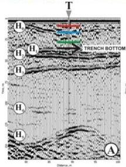
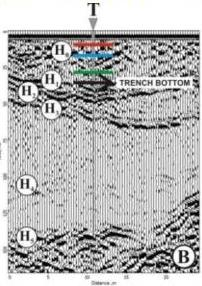
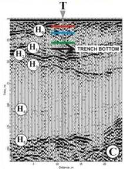
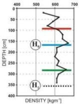
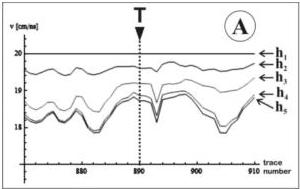
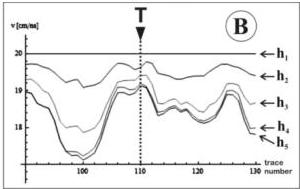
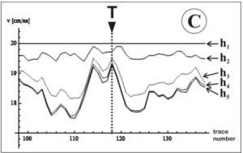

UNIVERSITAS DEGLI STUDIORUM
1343

UNIVERSITÀ
DEGLI STUDI
DITRIESTE

UD4d

# The inversion method: inversion results vs direct measurements

250 MHz

250 MHz perp

500 MHz perp

From pit

Inversion (VEM) results

250 MHz

250 MHz perp

500 MHz perp

Forte E., Dossi M., Pipan M. and Colucci R.R., 2014, Velocity analysis from Common Offset GPR data inversion: theory and

application to synthetic and real data, Geophysical Journal International, 197, 3, 1471-1483.

MEMAG A.A. 2021-2022

22