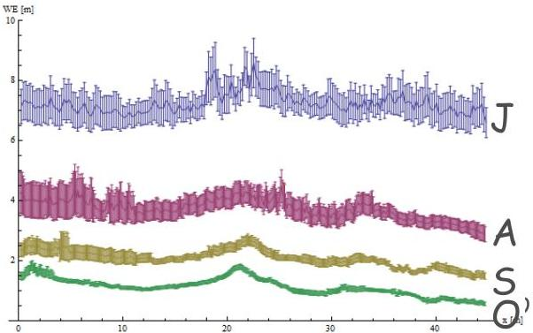

UNIVERSITAS
DEGLI STUDI
DI TRIESTE

UNIVERSITÀ
DEGLI STUDI
DI TRIESTE

UD4d

# The inversion method: inversion results vs direct measurements

Frozen material thicknesses calculated trace by trace along the EW profile, for using the velocity obtained with the inversion and the inversion and from direct measures interpolations (dots).

The error bars are obtained applying the propagation of maximum errors on all the inversion equations. The uncertainties of each input parameter are: (1) zero for the offset (i.e. not considered); (2) 0.2 cm/ns for the EM velocity in the shallowest layer; (3) 5% for both reference and reflected amplitudes and (4) half of the sampling interval for the traveltimes (0.119 ns)

Forte E., Colucci R. R., Dossi M. and Colle Fontana M., 2014, 4-D quantitative GPR analyses to study the summer mass balance of a glacier: a case history, invited lecture, Proceedings of the 15th International Conference on Ground Penetrating Radar, Bruxelles, 30th

June - 5th July 2014.

MEMAG A.A. 2021-2022

23