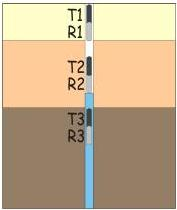
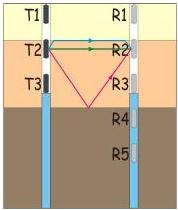
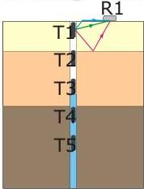

UNIVERSITAS DEGLI STUDIORITIS

UNIVERSITÀ
DEGLI STUDI
DI TRIESTE

UD4d

# Borehole GPR: motivations

1. Extend the information available from boreholes stratigraphy.
2. Overcome penetration depth limitations of surface GPR surveys.
3. Possible data inversion (both traveltimes → velocity and amplitude → attenuation) to recover “global” EM characteristics of the materials in addition to subsurface imaging.
4. Strategies already developed and exploited for reflection seismics can be adapted to EM waves

Reflection

T and R within the same borehole

Tomography

T and R within 2 different boreholes

Vertical Radar Profiling - VRP

T within a borehole R on the surface (or viceversa)

MEMAG A.A. 2021-2022

26