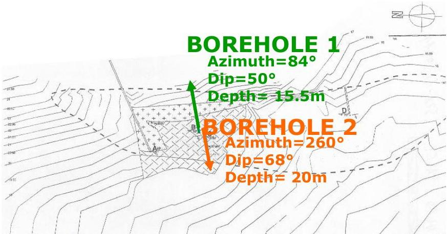

UNIVERSITAS DEGLI STUDIORITIS

UNIVERSITÀ
DEGLI STUDI
DI TRIESTE

UD4d

# A Borehole GPR Tomography example

Geological settings:

Grey or blackish limestone, with laminithic levels characterised by different organic material content.

Presence of fractures locally with karstic phenomena and vertebrate fossils.

Pipan et al., 2005

MEMAG A.A. 2021-2022

27